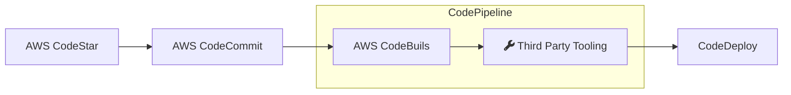

## AWS CodeStar

Host code and automatically build, test, and deploy your applications to AWS

The AWS Developer Tools is a set of services designed to enable developers and IT operations professionals practicing DevOps to rapidly and safely deliver software.

Together, these services help you securely store and version control your application's source code and automatically build, test, and deploy your application to AWS or your on-premises environment.

## AWS CodeCommit

Create secure repositories for sharing your code in the cloud

AWS CodeCommit is a fully-managed source control service that makes it easy for companies to host secure and highly scalable private Git repositories. CodeCommit eliminates the need to operate your own source control system or worry about scaling its infrastructure.

A common replacement of this could be github.

## AWS CodeBuild

Build and test code with elastic scaling. Pay only for the build time you use.

AWS CodeBuild is a fully managed continuous integration service that compiles source code, runs tests, and produces software packages that are ready to deploy. With CodeBuild, you don’t need to provision, manage, and scale your own build servers.

CodeBuild scales continuously and processes multiple builds concurrently, so your builds are not left waiting in a queue.

## AWS CodeDeploy

Automate code deployments to maintain application uptime

AWS CodeDeploy is a fully managed deployment service that automates software deployments to compute services such as Amazon EC2, AWS Lambda, and your on-premises servers.

AWS CodeDeploy makes it easier for you to rapidly release new features, helps you avoid downtime during application deployment, and handles the complexity of updating your applications.

## AWS CodePipeline

visualize and automate the different stages of your software release process

AWS CodePipeline is a continuous integration and continuous delivery service for fast and reliable application and infrastructure updates. CodePipeline builds, tests, and deploys your code every time there is a code change, based on the release process models you define..
