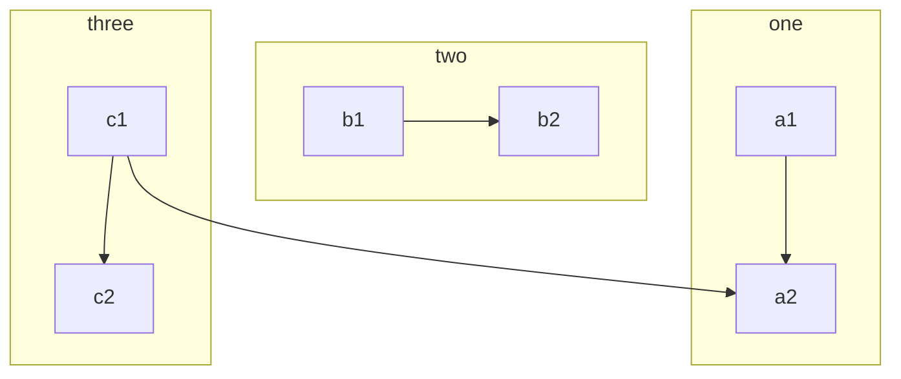

# Types Of Software Testing

## Functional Testing

### Unit Testing
### Integration Testing

System to System

### System Testing

?

### Sanity Testing

?

### Smoke Testing

Simple

### Interface Testing

### Accessibility Testing

Determine whether the software or application is accessible for disabled people or not.

### Regression Testing
### Beta/Acceptance Testing

## Non-functional Testing

## Performance Testing

System to system

User to system

Website performance

## Load Testing

## Stress Testing

## Volume Testing

## Security Testing
## Vulnerability Testing

Compatibility Testing
Install Testing
Recovery Testing
Reliability Testing
Usability Testing
Compliance Testing
Localization Testing
